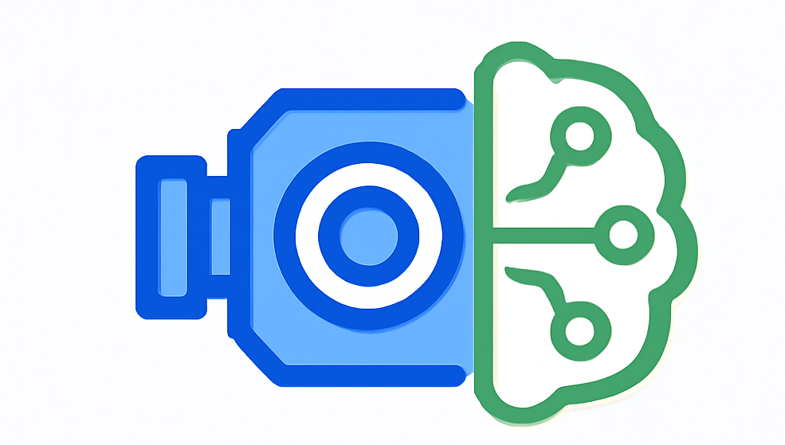

<div align="center">
  
  
  # QtCamDetect

  🚀 Real-Time Object Detection with Qt6 and DeepX DXRT Engine for Industrial Cameras
  
  [中文文档](README_zh.md)

</div>

<div align="center">


</div>

## 📖 Overview

**QtCamDetect** is a robust industrial vision application that seamlessly integrates **industrial camera control**, **real-time video stream processing**, and **YOLO-series object detection** powered by the **DeepX DXRT** inference engine. This project demonstrates how to deploy high-performance deep learning models in production-grade industrial vision systems for real-time video analysis and object recognition.

## ✨ Key Features

### 🎥 Industrial Camera Live Video Streaming

<div align="center">
  
</div>

- Auto-detect Dahua industrial cameras
- Real-time video stream capture and display
- Image snapshot and export capabilities

### 🤖 Real-Time YOLO Object Detection

<div align="center">
  
</div>

- Support for YOLO-series models
- Hardware-accelerated inference with DeepX NPU
- Real-time bounding box and label rendering
- Multi-threaded asynchronous processing

## 🛠️ Technology Stack

| Component | Version/Description |
|-----------|---------------------|
| **Language** | C++17 |
| **UI Framework** | Qt 6.7.3 (MSVC 2022 64-bit) |
| **IDE** | Visual Studio 2022 |
| **Computer Vision** | OpenCV 4.9.0 |
| **Inference Engine** | DeepX DXRT v2.9.5 |
| **Detection Model** | YOLO Series (.dxnn format) |
| **Camera SDK** | Dahua Industrial Camera SDK (MVSDK) |

## 🚀 Quick Start

### ⚡ Get Your Vision Application Running in 3 Steps

#### **Step 1: Environment Setup**

1. **Install Visual Studio 2022**
   - Ensure the "Desktop development with C++" workload is installed
   - Platform toolset: v143

2. **Install Qt 6.7.3**
   - Download and install Qt 6.7.3 MSVC 2022 64-bit version
   - Default installation path: `C:\Qt\6.7.3\msvc2022_64`
   - If using a different path, update the `QtPath` property in the `.vcxproj` file

#### **Step 2: Clone Repository with Dependencies**

All dependencies (OpenCV, DXRT, Camera SDK) are hosted in the repository via **Git LFS**.

```powershell
# 1. Install Git LFS (if not already installed)
git lfs install

# 2. Clone the repository (automatically pulls LFS files)
git clone https://github.com/Chris-godz/Nodka-DeepX-Dahua-Camera.git
cd Nodka-DeepX-Dahua-Camera

# 3. If already cloned but LFS files are missing, manually pull them
git lfs pull
```

#### **Step 3: Build and Run**

**Option 1: Using Visual Studio 2022 GUI**
1. Open `QtCamDetect.sln` solution file
2. Select build configuration from the toolbar: `Release | x64`
3. Right-click the project → Select **"Build"**
4. After compilation, the executable is located at: `x64/Release/QtCamDetect.exe`

**Option 2: Using MSBuild Command Line**

```powershell
# 1. Open "Developer PowerShell for VS 2022" or configure MSBuild environment
# Typically located at: C:\Program Files\Microsoft Visual Studio\2022\Community\Common7\Tools\Launch-VsDevShell.ps1

# 2. Navigate to the project directory
cd C:\Path\To\QtCamDetect

# 3. Build the Release version with MSBuild
msbuild QtCamDetect.sln /p:Configuration=Release /p:Platform=x64 /m

# 4. Run the application
.\x64\Release\QtCamDetect.exe
```

## 📁 Project Structure

```
QtCamDetect/
├── assets/                  # Resource files
│   ├── models/              # YOLO model files (.dxnn)
│   └── video/               # Test video files
├── dependencies/            # Third-party libraries
│   ├── camera_sdk/          # Industrial camera SDK
│   ├── dxrt/                # DeepX DXRT inference engine
│   └── opencv/              # OpenCV library
├── include/                 # Header files
│   ├── ui/                  # UI-related headers
│   │   ├── MainWindow.h     # Main window
│   │   ├── CameraController.h  # Camera controller
│   │   ├── YoloDetector.h   # YOLO detector
│   │   └── VideoSource.h    # Video source manager
│   ├── yolo/                # YOLO algorithm headers
│   │   ├── yolo.h           # YOLO core
│   │   ├── bbox.h           # Bounding box processing
│   │   └── nms.h            # Non-maximum suppression
│   └── utils/               # Utility classes
│       └── color_table.hpp  # Color mapping table
├── src/                     # Source files
│   ├── ui/                  # UI implementation
│   │   ├── main.cpp         # Application entry point
│   │   ├── MainWindow.cpp   # Main window implementation
│   │   ├── CameraController.cpp  # Camera control implementation
│   │   ├── YoloDetector.cpp # YOLO detection implementation
│   │   └── VideoSource.cpp  # Video source implementation
│   └── yolo/                # YOLO algorithm implementation
│       ├── yolo.cpp         # YOLO core logic
│       ├── bbox.cpp         # Bounding box processing
│       └── nms.cpp          # NMS algorithm
├── resources/               # Qt resources
│   ├── ui/                  # UI design files (.ui)
│   └── icons/               # Application icons
├── x64/                     # Build output directory
│   ├── Debug/               # Debug build
│   └── Release/             # Release build
├── QtCamDetect.sln          # Visual Studio solution
├── QtCamDetect.vcxproj      # Project configuration file
└── README.md                # English documentation
```

## 📄 License

This project is licensed under the Apache License 2.0 - see the [LICENSE](LICENSE) file for details.

## 🙏 Acknowledgements

- Thanks to the [Qt Project](https://www.qt.io/) for providing an excellent cross-platform UI framework
- Thanks to [OpenCV](https://opencv.org/) for the powerful computer vision library
- Thanks to [DeepX](https://www.deepx.ai/) for the high-performance DXRT deep learning inference engine
- Thanks to [Ultralytics](https://github.com/ultralytics/ultralytics) for the state-of-the-art YOLO object detection algorithms

---

<div align="center">
  
**If you find this project helpful, please give us a ⭐ Star!**

Made with ❤️ by [Chris-godz](https://github.com/Chris-godz)

</div>
