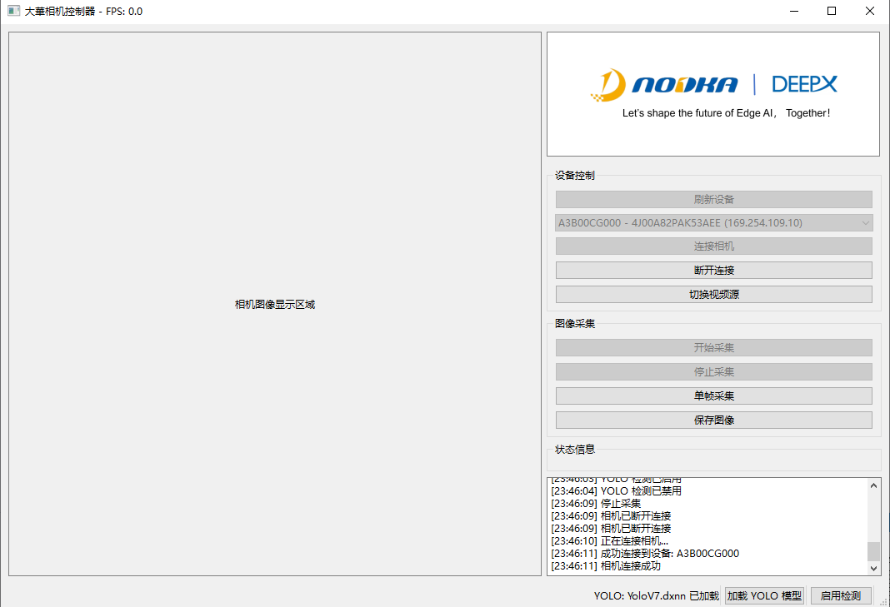

<div align="center">
  
  
  # QtCamDetect

  🚀 基于 Qt6 与 DeepX DXRT 引擎的工业相机实时目标检测应用
  
  [English README](README.md)

</div>

<div align="center">


</div>

## 📖 项目简介

**QtCamDetect** 是一个功能强大的工业视觉应用程序，集成了**工业相机控制**、**实时视频流处理**以及使用 **DeepX DXRT** 推理引擎部署的 **YOLO 系列目标检测**功能。该项目展示了如何将高性能深度学习模型无缝集成到实际的工业视觉场景中，实现对视频流的实时分析与目标识别。

## ✨ 核心功能

### 🎥 工业相机实时视频流

<div align="center">
  
</div>

- 自动检测大华工业相机
- 实时视频流捕获与显示
- 图像抓拍与保存

### 🤖 YOLO 实时目标检测

<div align="center">
  
</div>

- 支持 YOLO 系列模型
- DeepX NPU 加速推理
- 实时绘制检测框与标签
- 多线程异步处理

## 🛠️ 技术栈


| 技术组件 | 版本/说明 |
|---------|----------|
| **编程语言** | C++17 |
| **UI 框架** | Qt 6.7.3 (MSVC 2022 64-bit) |
| **开发环境** | Visual Studio 2022 |
| **计算机视觉库** | OpenCV 4.9.0 |
| **深度学习推理引擎** | DeepX DXRT v2.9.5 |
| **目标检测模型** | YOLO 系列 (.dxnn 格式) |
| **相机 SDK** | 大华工业相机 SDK (MVSDK) |


## 🚀 快速开始

### ⚡ 三步启动您的智能视觉应用

#### **步骤 1：环境准备**

1. **安装 Visual Studio 2022**
   - 确保已安装 "使用 C++ 的桌面开发" 工作负载
   - 平台工具集：v143

2. **安装 Qt 6.7.3**
   - 下载并安装 Qt 6.7.3 MSVC 2022 64-bit 版本
   - 默认安装路径：`C:\Qt\6.7.3\msvc2022_64`
   - 如路径不同，需在 `.vcxproj` 文件中修改 `QtPath` 属性

#### **步骤 2：拉取项目依赖库**

本项目的所有依赖库（OpenCV、DXRT、Camera SDK）已通过 **Git LFS** 托管在仓库中。

```powershell
# 1. 安装 Git LFS（如果尚未安装）
git lfs install

# 2. 克隆项目并自动拉取 LFS 文件
git clone https://github.com/Chris-godz/Nodka-DeepX-Dahua-Camera.git
cd Nodka-DeepX-Dahua-Camera

# 3. 如果已克隆但未拉取 LFS 文件，手动拉取
git lfs pull
```

#### **步骤 3：编译与运行**

**方式 1：使用 Visual Studio 2022（图形化界面）**
1. 双击打开 `QtCamDetect.sln` 解决方案文件
2. 在顶部工具栏选择构建配置：`Release | x64`
3. 右键点击项目 → 选择 **"生成"**
4. 编译完成后，可执行文件位于：`x64/Release/QtCamDetect.exe`

**方式 2：使用 MSBuild（命令行）**

```powershell
# 1. 打开 "Developer PowerShell for VS 2022" 或配置 MSBuild 环境变量
# 通常位于：C:\Program Files\Microsoft Visual Studio\2022\Community\Common7\Tools\Launch-VsDevShell.ps1

# 2. 进入项目目录
cd C:\Path\To\QtCamDetect

# 3. 使用 MSBuild 编译 Release 版本
msbuild QtCamDetect.sln /p:Configuration=Release /p:Platform=x64 /m

# 4. 运行程序
.\x64\Release\QtCamDetect.exe
```

## 📁 项目结构


```
QtCamDetect/
├── assets/                  # 资源文件
│   ├── models/              # YOLO 模型文件 (.dxnn)
│   └── video/               # 测试视频文件
├── dependencies/            # 第三方依赖库
│   ├── camera_sdk/          # 工业相机 SDK
│   ├── dxrt/                # DeepX DXRT 推理引擎
│   └── opencv/              # OpenCV 库
├── include/                 # 头文件
│   ├── ui/                  # UI 相关头文件
│   │   ├── MainWindow.h     # 主窗口
│   │   ├── CameraController.h  # 相机控制器
│   │   ├── YoloDetector.h   # YOLO 检测器
│   │   └── VideoSource.h    # 视频源管理
│   ├── yolo/                # YOLO 算法头文件
│   │   ├── yolo.h           # YOLO 核心
│   │   ├── bbox.h           # 边界框处理
│   │   └── nms.h            # 非极大值抑制
│   └── utils/               # 工具类
│       └── color_table.hpp  # 颜色映射表
├── src/                     # 源文件
│   ├── ui/                  # UI 实现
│   │   ├── main.cpp         # 程序入口
│   │   ├── MainWindow.cpp   # 主窗口实现
│   │   ├── CameraController.cpp  # 相机控制实现
│   │   ├── YoloDetector.cpp # YOLO 检测实现
│   │   └── VideoSource.cpp  # 视频源实现
│   └── yolo/                # YOLO 算法实现
│       ├── yolo.cpp         # YOLO 核心逻辑
│       ├── bbox.cpp         # 边界框处理
│       └── nms.cpp          # NMS 算法
├── resources/               # Qt 资源
│   ├── ui/                  # UI 设计文件 (.ui)
│   └── icons/               # 应用图标
├── x64/                     # 编译输出目录
│   ├── Debug/               # Debug 版本
│   └── Release/             # Release 版本
├── QtCamDetect.sln          # Visual Studio 解决方案
├── QtCamDetect.vcxproj      # 项目配置文件
└── README_zh.md             # 中文说明文档
```

##  开源协议

本项目采用 Apache License 2.0 开源协议 - 详见 [LICENSE](LICENSE) 文件。

## 🙏 致谢

- 感谢 [Qt 项目](https://www.qt.io/) 提供优秀的跨平台 UI 框架
- 感谢 [OpenCV](https://opencv.org/) 提供强大的计算机视觉库
- 感谢 [DeepX](https://www.deepx.ai/) 提供高性能深度学习推理引擎 DXRT
- 感谢 [Ultralytics](https://github.com/ultralytics/ultralytics) 提供先进的 YOLO 目标检测算法

---

<div align="center">
  
**如果这个项目对您有帮助，请给我们一个 ⭐ Star！**

Made with ❤️ by [Chris-godz](https://github.com/Chris-godz)

</div>
```
